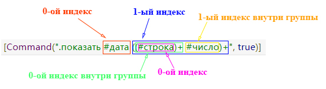

### Библиотека для создания ботов ВКонтакте
**VkBotHelper** - производительная *.NET Core* библиотека , которая поможет вам создать бота для любых бесед или диалогов в виде меню или текстовых команд со сложной логикой. Причём, обработчики команд могут быть как и ассинхронные *(async/await)*, так и синхронные. Команды задаются с помощью атрибутов  **[Command("шаблон команды")]** над соответсвующими методами-обработчиками.
Библиотека поддерживает Dependency Injection через Unity.
Взаимодействие с Api-ВКонтакте происходит путём библиотеки VkNet.

------------
#### Краткое введение

Создадим простого бота, который будет отвечать пользователю **"привет-привет"**, на команду **".привет"**.

Для начала создадим класс, в котором будет метод, обрабатывающий данную команду.

````csharp
    public class SimpleCommand
    {
		private readonly IVkApi _api;
		
		/* 
		* конструктор класса, здесь указываете нужные зависимости для
		* ваших команд. Зависимости должны быть зарегестрированы
		* в Unity (подробнее ниже).
		*/
		SimpleCommand(IVkApi api)
		{
			// IVkApi - предназначается для работы с API Вконтакте.
			_api = api;
		}
	
	/* 
	* Аттрибут команды. Первый аргумент - шаблон команды, 
        * второй - признак того, что команда является глобальной. Подробнее о аттрибуте смотрите ниже. 
        */
        [Command(".привет", true)]
        public void Hi(CommandArgs args)
        {
        	 _api.Messages.Send(new MessagesSendParams
             	{
			Message = "привет-привет",
			PeerId = args.SourceMessage.PeerId,
			RandomId = new Random().Next()
		});
        }
}
````

Теперь в методе Main напишем следующее:

````csharp
VkBot.StartNewCommandBot("Токен Группы", id группы, 
	builder =>
	{
		//здесь регистрируем классы, в которых лежат обработчики команд
		builder.Register<SimpleCommand>();
	},
	container =>
	 {
		/* здесь регистрируем любые зависимости, 
		* например контекст базы данных, нужные сервисы и так далее,
		* которые будут передаваться в конструкторы классов команд.
		* по умолчанию уже зарегистрированы некоторые зависимости,
		* например, IVkApi.
		*
		* Поэтому здесь нам больше ничего не нужно.
		*.
	});`
````

------------
#### Команды

Методы, отвечающие за обработку команд, помечаются специальным атрибутом `[Command(string pattern, bool isGlobal)]`

##### Обьявление обработчиков команд

Необходимо в классе, отвечающем за выполнение этой команды, объявить метод с любым названием. Причём, возвращаемое значение может либо *Task* (для асинхронного выполнения) (также метод может содержать *async*), либо *void*. Аргумент метода может быть только типа *CommandArgs*, можно также опустить этот аргумент вовсе.

----
##### Шаблоны команд
Мощным средством данной библиотеки является то, что шаблоны могут в себя включать не только обычный текст, а также набор плейсхолдеров. Например: **".показать #дата"**- также является командой. И всякий раз, когда пользователь будет отправлять **".показать 21/10/2016"**, метод-обработчик будет срабатывать. Причём получить значение этой даты в самом обработчике очень просто.

```csharp
        [Command(".показать #дата", true)]
        public void Show(CommandArgs args)
        {
	    // значение
            var date = args.ValueContainer.Get<Date>(0);
        }
```


Поддерживаются следующие виды плейсхолдеров:

| Имя  |  Описание | Тип  |
| ------------ | ------------ | ------------ |
| #дата | дата без времени, поддерживает следующие виды разделяющих символов: 01/01/2001 или 01-01-2001 или 01.01.2001. Может быть без года, например: 01-12  |  Date |
|  #время |  время в формате HH:MM (например, 12:30) | TimeSpan  |
|  #строка | строка заключанная в кавычки 'строка', "строка", «строка»  |  string |
|  #число | дробное (через запятую) или целое число  | double  |
|  #обращение | обращение ВКонтакте (к пользователю или группе) (обычно, начинается с @)  | VkAtSign  |
| #день_смещение  |  например, "послезавтра" или "позапозавчера", "вчера" |  int (смещение относительно текущего дня) |
| #день_недели  |  день недели на русском в краткой или полной форме. также поддерживает префикс следующий или предыдущий. Например, следующий четверг (или след чт). Или предыдущая пятница (пред пт). |  int (смещение относительно понедельника текущей недели) |

Кроме того, в случае, если какая то часть шаблона, например, может повторятся неопределённое количество раз, можно обернуть её в **()+**, как в регулярных выражениях.
Например: **".удалить (#число)+"**
Тем самым, под шаблон подходит текст: **".удалить 1 5 8 19 18 13"**

###### Получение значений
Для получения значения плейсхолдера необходимо вызвать метод *Get* c небходимым индексом. Индексация начинается с 0. Причём внутри каждой группы *()+* плейсходеры также начинают индекс с 0.

Рассмотрим получение значений на следующем примере шаблона **".показать #дата ((#строка)+ #число)+"**: Под данное выражение может подходить сообщение: **".показать 06.12 'какая то строка' 'ещё строка' 15"**

```csharp
        [Command(".показать #дата ((#строка)+ #число)+", true)]
        public void Test(CommandArgs args)
        {
            //#дата
            var date = args.ValueContainer.Get<Date>(0);

            //группа ((#строка)+ #число)+
            var mainGroup = args.ValueContainer.Get<GroupContainer>(1);

            // проходим по каждому повторению группы ((#строка)+ #число)+
            foreach (var mainRepeat in mainGroup)
            {
                //группа (#строка)+
                var innerGroup = mainRepeat.Get<GroupContainer>(0);

                // проходим по каждому повторению группы (#строка)+
                foreach (var innerRepeat in innerGroup)
                {
                    //#строка
                    var str = innerRepeat.Get<string>(0);
                }

                //#число
                var number = mainRepeat.Get<double>(1);
            }
        }
```



----------------


##### Глобальные и контекстные команды
Второй аргумент атрибута определяет, является ли команда глобальной.
- **Глобальная команда** (true) может запускаться только тогда, когда в чате или беседе нет активной команды.
- **Контекстная команда** (false) может запускаться только тогда, когда в чате или беседе уже установлена активная команда из этого же класса.

Для того, что установить  активной команду нужно вызвать метод *SetActiveCommand* в **ICommandManager**. Для удаления необходимо вызвать *RemoveActiveCommand*.

Это используется для того, что бы создавать цепочку из состояний команд. Когда в чате установлена активная команда, бот не будет реагировать на другие команды. А будет реагировать только на те команды, которые являются контекстными и расположены в том же классе, в котором находится и активная команда. 
При запуске контекстной команды, используется сохранённый экземпляр класса активной команды, а не создаётся новый, поэтому всё состояние сохраняется.

###### Пример:
При сообщении *".удалить"*  в чате устанавливается активная команда Question в классе DeleteItemCommand. После чего, бот будет реагировать только на все контекстные команды в классе DeleteItemCommand, а именно: ".да" и ".нет". 
Главное, не забывать удалять активную команду при необходимости. Иначе, например, забыв написать *RemoveActiveCommand* в обработчике *".да"*,  можно будет бесконечно писать *".да"* и код внутри будет выполняться.

```csharp
class DeleteItemCommand
    {
        private readonly ICommandManager _manager;
        private readonly IVkApi _api;
	private int counter = 0;

	//подключаем ICommandManager для управления командами
        public DeleteItemCommand(ICommandManager manager, IVkApi api)
        {
            _manager = manager;
            _api = api;
        }

        [Command(".удалить", true)]
        public void Question(CommandArgs args)
        {
	    // устанавливаем текущую команду как активную
            _manager.SetActiveCommand(args.SourceMessage.PeerId.Value, args.RunMetadata, this);

            _api.Messages.Send(new MessagesSendParams()
            {
                Message = "Вы точно хотите удалить элемент?",
                PeerId = args.SourceMessage.PeerId, 
                RandomId = new Random().Next()
            });

	    counter = 5;
        }

        [Command(".да", false)]
        public void Yes(CommandArgs args)
        {
            //удаляем активную команду
	    _manager.RemoveActiveCommand(args.SourceMessage.PeerId.Value);
			
            // реагируем на ответ
	    // counter будет равен 5, состояние в контекстных командах сохраняется.
        }

        [Command(".нет", false)]
        public void No(CommandArgs args)
        {
            //удаляем активную команду
	    _manager.RemoveActiveCommand(args.SourceMessage.PeerId.Value);

            // реагируем на ответ
	    // counter будет равен 5, состояние в контекстных командах сохраняется.
        }
```
